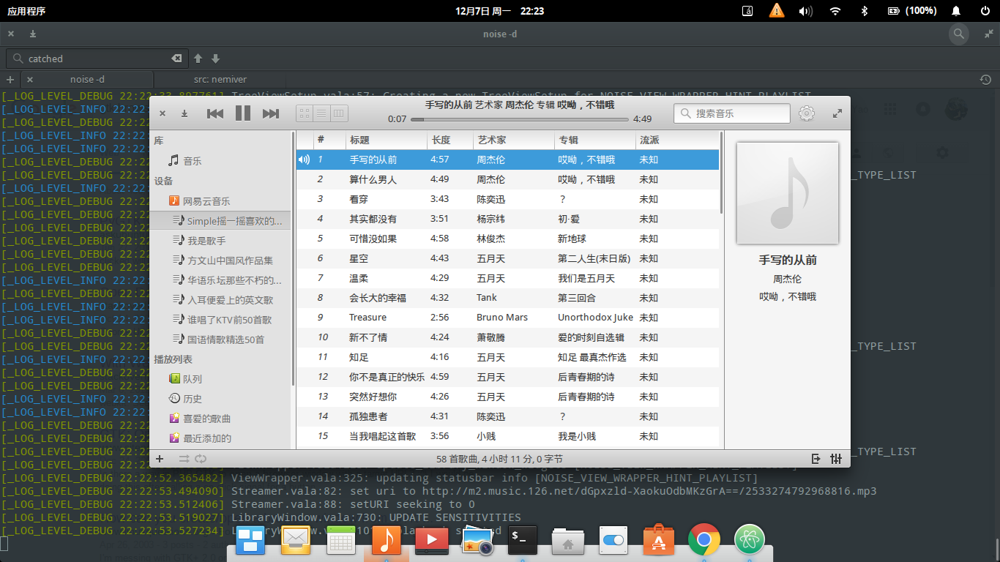

# 网易云音乐 Noise 插件

elementaryOS 上的自带播放器 Noise 的网易云音乐插件插件。


## 功能

 * 从网易云音乐库搜索音乐
 * 登录网易云音乐帐户
 * 获取个人的歌单

## 截图




## 安装

添加 PPA 并安装：

```sh
sudo add-apt-repository ppa:simpleyyt/ppa
sudo apt-get update
sudo apt-get install noise-neteasemusic
```

## 编译

先行安装 Noise 播放器，如果是 elementaryOS 可免去此步：

```sh
sudo add-apt-repository ppa:elementary-os/daily
sudo apt-get install noise
```

安装编译依赖：

```sh
sudo apt-get build-dep noise
sudo apt-get install libnoise-core-dev libgmp-dev nettle-dev
```

安装：

```sh
mkdir build
cd build
cmake .. -DCMAKE_INSTALL_PREFIX=/usr
make
sudo make install
```

## Bugs

 * 由于没有缓存 Cookie，所以每次打开都会自动登录，所以可能会出现 IP 高频的错误。
 * 歌单的操作功能还没有实现。
 * 由于搜索功能实现的有点暴力，所以可能会出问题。
